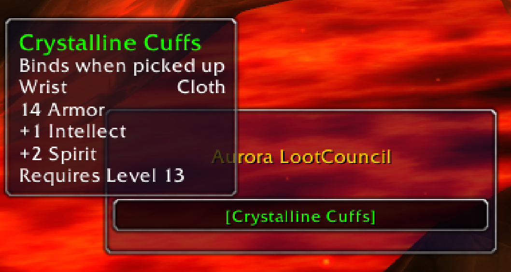
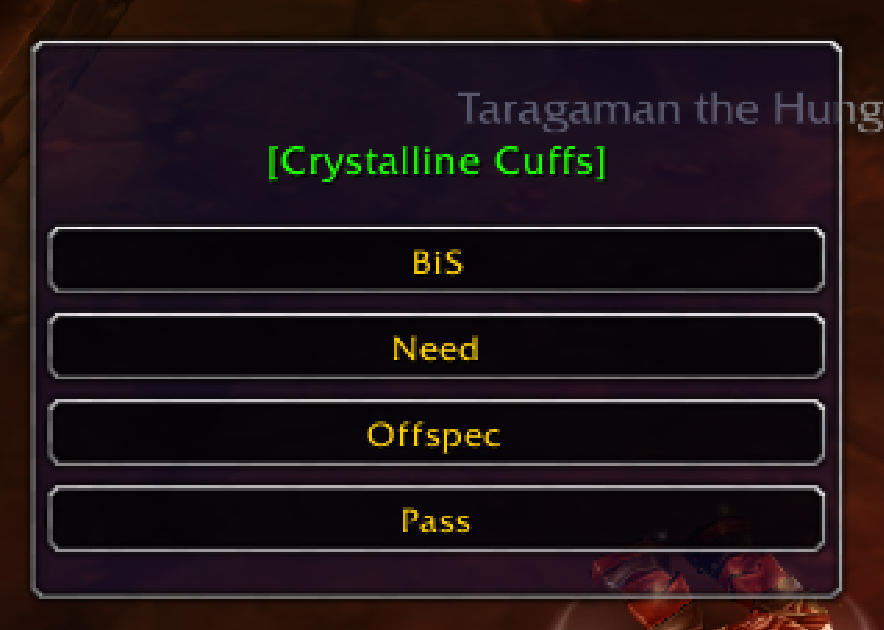
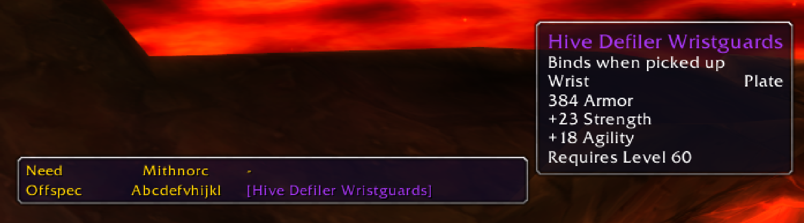

## Description

Loot overview and distribution addon for 1.12.1 World of Warcraft.

This Addon is in an early stage, there might be breaking bugs. If you feel like the addon broke in some way, it can be reset by the loot master by entering "/console reloadui" into the in-game chat. The Addon will try to fix itself when the next corpse is looted by the loot master.

## Installation

1. Close World of Warcraft.
2. Extract the "AuroraCouncil" directory into "your\path\to\World of Warcraft\Interface\AddOns\".
3. Activate AuroraCouncil in the character selection screen under "Addons".

## Usage

The Addon will activate itself when you're in a Group/Raid with masterloot activated.

General Flow:
1. Loot master is looting a corpse.
2. If there is loot that can be distributed via master loot, the loot distribution will start.
3. Loot master clicks on an item to distribute, a window with loot options (need, greed etc...) will appear for everyone.
4. After selecting a loot option by clicking on it, you will see a list of players along with their decision.
5. The loot master can now select a player in the list to distribute the loot to.
6. Steps 2 - 5 repeat until there is no assignable loot left.

## Screenshots
##### Loot master frame

 
##### Loot options frame

 
##### Loot overview frame

## Questions? Issues? Contributions?
If you have any questions, issues or want to contribute to the project, feel free to join the AuroraCouncil Discord:
https://discord.gg/VmCmU

## License

This Software is licensed under MIT, see [LICENSE.md](/LICENSE.md) for more details.
